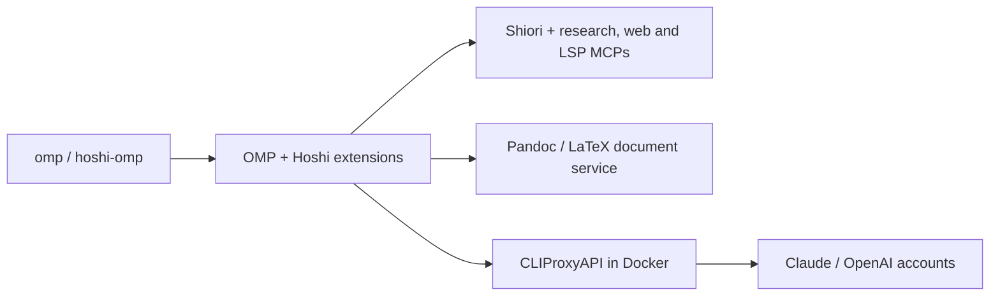

<div align="center">

# hoshi-omp

**Hoshi's development workflow, permissions and document tools for Oh My Pi.**

*A macOS-tested profile for the official OMP CLI, backed by a local Docker model gateway.*

[](package.json)
[](package.json)
[](proxy/README.md)
[](LICENSE)

[Features](#features) · [Quick start](#quick-start) · [Security](#security) · [Development](#development)

</div>

> **Keep Hoshi's workflow while changing its host.**

> [!NOTE]
> Pre-1.0 pilot. The SDK is pinned to OMP 18.8.0; the official CLI was validated at 18.8.3 and updates independently. Host differences are documented in [Compatibility](docs/compatibility.md).

## At a glance

| | |
|---|---|
| **Entry points** | `omp`; `hoshi-omp` for role selection and gateway management |
| **Roles** | 16 configured roles; `orchestrator` defaults to medium reasoning |
| **Tools** | Five enabled MCP servers and eleven `docs_*` tools |
| **Models** | Claude and OpenAI through CLIProxyAPI at `127.0.0.1:18317` |
| **State** | `.runtime/`; project plans and drafts in `.opencode/` |

## Features

### Development workflow

- **Scoped agents:** the orchestrator handles small tasks directly and delegates larger work to specialists.
- **Plans and reviews:** Shiori manages durable workplans; Hoshi enforces role ownership and tool permissions.

### Project context and documents

- **Local instructions and skills:** discover project `.opencode`, `.codex`, `.claude`, `.agents`, `.agent` and `.gemini` folders.
- **Document tools:** draft, compile and convert documents through the Pandoc/LaTeX service and presets.

### Runtime controls

- **Context management:** image budgets, cache advisories and manual tool-result compression preserve stored history.
- **Accounts and approvals:** provider quota tracking and GPT-6-Luna approval reviews use the local gateway.

## Architecture



The official CLI loads the Hoshi profile; model requests pass through CLIProxyAPI. See [component mapping and limitations](docs/compatibility.md).

## Quick start

**Requirements:** Bun, Go 1.27.1+, Node.js 20+ and Docker Compose; Pandoc/TeX for document compilation. Start in this repository's root.

```sh
# 1. Install the validated CLI and prepare Hoshi.
bun install -g @oh-my-pi/pi-coding-agent@18.8.3
bun install --frozen-lockfile
bun run setup

# 2. Connect the default OMP profile and expose the launcher.
bun scripts/connect-official.ts
bun scripts/install-path.ts
export PATH="$HOME/.bun/bin:$HOME/.local/bin:$PATH"

# 3. Start the gateway and authenticate both providers.
hoshi-omp proxy start
hoshi-omp proxy login claude
hoshi-omp proxy login codex

# 4. Launch in your project.
cd ~/projects/example
hoshi-omp
```

**Next steps:**

| Step | Guide |
|---|---|
| Understand profile changes | [Setup and profile connection](docs/setup.md) |
| Develop or review | `/dev <request>` or `/hoshi-review <request>` |
| Select a role or check quotas | `/hoshi-agent orchestrator` or `/hoshi-usage` |
| Manage provider login and gateway | [Gateway guide](proxy/README.md) |
| Resume and update OMP | [Daily-driver pilot](docs/pilot.md) |

## Security

> [!IMPORTANT]
> Keep the permissions extension enabled: native OMP approvals use `yolo`, while Hoshi enforces tool policies. These controls are not an OS sandbox.

- **Private state:** `.runtime/` holds credentials and sessions and is ignored by Git.
- **Local gateway:** API and temporary OAuth callback ports bind to localhost.
- **Approval boundaries:** explicit denials remain enforced; headless children cannot approve actions that require confirmation. See [permission behavior](docs/compatibility.md#permissions).

## Development

```sh
bun run typecheck
bun run test
bun test packages/docs/src

# Prepare the runtime profile and check the offline session and local MCPs.
bun run smoke
bun scripts/mcp-smoke.ts
```

See [recorded validation and its limits](docs/validation.md).

<details><summary>Repository layout</summary>

| Path | Contents |
|---|---|
| `agent/` | Agents, prompts, instructions, skills and theme |
| `config/` | Role, permission, model-routing and MCP definitions |
| `extensions/`, `lib/` | OMP integration and policy logic |
| `packages/docs/` | Host-independent document service and assets |
| `vendor/shiori/`, `mcps/` | Local server sources and licenses |
| `source-config/` | Original generator policy and host-specific settings for reference |
| `scripts/`, `tests/` | Setup, smoke checks and regression tests |
| `compose.yml`, `proxy/` | Container gateway and guide |
| `docs/` | Setup, compatibility and validation notes |

</details>

## Non-goals

This port does not replace OpenCode Desktop, migrate its session history, or promise identical UI rendering, provider quotas or model limits across hosts.

## License

[GPL-3.0-or-later](LICENSE); third-party components retain the terms listed in [NOTICE](NOTICE).
