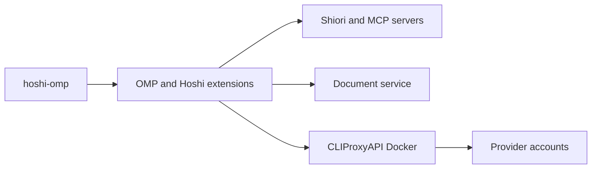

<div align="center">

# hoshi-omp

**Hoshi agents, permissions and document tools for Oh My Pi.**

*An isolated trial port of hoshi-opencode2 with a local Docker model gateway.*

[](https://github.com/can1357/oh-my-pi/releases/tag/v18.8.3)
[](https://github.com/router-for-me/CLIProxyAPI/releases/tag/v8.0.18)
[](LICENSE)

[Quick start](#quick-start) · [Compatibility](docs/compatibility.md) · [Gateway](proxy/README.md)

</div>

> **Keep Hoshi's workflow while changing its host.** Existing OpenCode configuration remains independent.

> [!NOTE]
> Trial release. OMP is pinned; CLIProxyAPI is pinned by image digest. Provider sign-in is required before model requests. This is a functional port, with documented differences rather than byte-for-byte OpenCode behavior.

## At a glance

| | |
|---|---|
| **Commands** | `hoshi-omp`, `omp` |
| **Agents** | 16 roles; `orchestrator` is the default (medium reasoning) |
| **Tools** | Shiori, document generation, research, web and LSP MCPs |
| **Gateway** | CLIProxyAPI in Docker, `127.0.0.1:18317` |
| **State** | Private `.runtime/`; existing projects retain `.opencode/workplan` and `.opencode/docs` |

## Features

- **Role policies:** imported allow/ask/deny rules and Shiori lifecycle ownership run through OMP tool hooks.
- **Document tools:** all eleven `docs_*` tools reuse the Pandoc/LaTeX service and templates.
- **Runtime controls:** image budgets, cache advisories and provider-aware reasoning bounds.
- **Quota tracking:** `/hoshi-usage` reads provider quota windows for accounts signed in through the gateway.
- **Worker controls:** direct-child listing and interruption, plus OMP's Agent Hub.
- **Manual compression:** summarize selected tool results while retaining user instructions and stored history.

## Architecture



## Quick start

**Requirements:** Bun, Go, Node.js and Docker; Pandoc/TeX for document compilation.

```sh
# 1. Install OMP officially, then prepare and connect the Hoshi profile.
bun install -g @oh-my-pi/pi-coding-agent
bun install --frozen-lockfile
bun run setup
bun scripts/connect-official.ts
bun scripts/install-path.ts

# 2. Start the gateway and sign in with your own provider accounts.
hoshi-omp proxy start
hoshi-omp proxy login claude
hoshi-omp proxy login codex
hoshi-omp proxy models

# 3. Launch from the project you want to work on.
cd ~/projects/example
omp
```

| Next step | Command or guide |
|---|---|
| Select an orchestrator | `hoshi-omp --agent orchestrator` or `/hoshi-agent orchestrator` |
| Update the official runtime | `omp update` (the Bun global installation owns this command) |
| Run your development workflow | `/dev <request>` |
| Use the imported review workflow | `/hoshi-review <request>`; OMP owns `/review` |
| Stop the gateway | `hoshi-omp proxy stop` |
| Check differences | [Compatibility and plugin mapping](docs/compatibility.md) |

## Security

> [!IMPORTANT]
> `.runtime/` holds client keys, OAuth credentials and sessions and is ignored by Git. The Docker API port is bound to localhost. OAuth callback ports are published only during login.

The required permissions extension owns tool approvals; OMP's generic approval mode is `yolo` to avoid duplicate approval prompts. This is not an OS sandbox. Unknown execution routes and complex shell commands fail closed or require interactive approval; child agents cannot answer those prompts.

## Development

```sh
bun run typecheck
bun test tests
bun test packages/docs/src
bun run smoke
bun scripts/mcp-smoke.ts
```

<details><summary>Repository layout</summary>

| Path | Contents |
|---|---|
| `agent/` | Imported agents, prompts, instructions and skills |
| `config/` | Role, permission, model-routing and MCP definitions |
| `extensions/`, `lib/` | OMP compatibility plugins |
| `packages/docs/` | Host-independent document service and assets |
| `vendor/shiori/`, `mcps/` | Local server sources and licenses |
| `source-config/` | Original generator policy and host-specific settings for reference |
| `compose.yml`, `proxy/` | Container gateway and guide |

</details>

## Non-goals

This trial does not migrate OpenCode session history, replace OpenCode Desktop, or promise identical provider quotas and UI rendering through a gateway.

## License

[GPL-3.0-or-later](LICENSE); third-party components retain the terms listed in [NOTICE](NOTICE).
