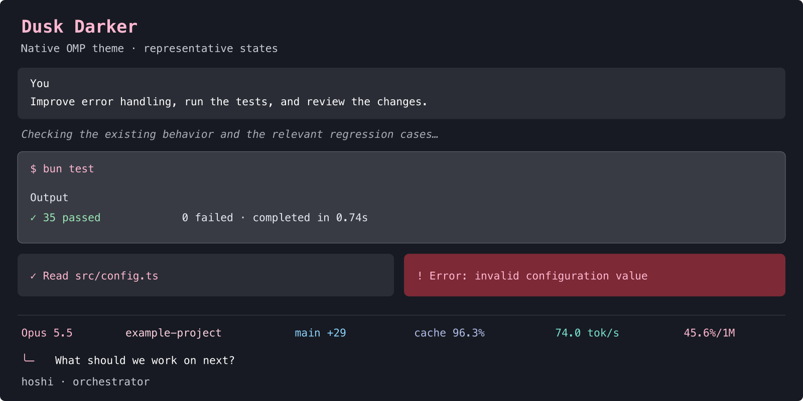

# Dusk Darker

`agent/themes/dusk-darker.json` is a native OMP theme based on Hoshi's Starship `dusk-darker` palette and Ghostty theme. It includes the matching 16-color terminal palette, Markdown and syntax colors, tool states, thinking levels, status segments and HTML-export surfaces.

The dark slot is selected in `config/omp.yml`; `hoshi-omp setup` installs tracked themes into the isolated profile. An existing session can select it from `/settings` → Appearance → Dark Theme. OMP applies theme changes live.

The mapping keeps the charcoal `#171A22` canvas, white text, pink tool/model accents, teal shell/worker/token-rate highlights and sky Git indicators. Cache uses lavender; errors use red and warnings yellow. Tool output uses bright secondary text; thinking is subdued. Low-contrast surface colors are reserved for decorative boundaries.

`statusLine.sessionAccent: false` keeps the model accent consistent with the palette. `composer.tokenRate: false` removes the duplicate composer rate while retaining the footer rate.

`composer.shape: box` adds a rounded frame and horizontal inset before the model indicator. The Hoshi composer extension closes the whole bottom rule and keeps four empty typing rows, growing to eight visible rows before scrolling. It preserves the draft, cursor, Vim bindings and autocomplete. The default `band` shape has no top-left corner. The partially filled circle next to the model is the compact reasoning-level indicator; `◒` means high.

The preview uses colors resolved by OMP's native theme loader. Schema validation, profile discovery and loading in truecolor and 256-color modes passed. The checked primary text/background pairs have contrast ratios of at least 4.95:1 in truecolor; the preview is illustrative rather than a capture of a running session.

The terminal palette matches the existing Ghostty theme. The OMP theme does not modify Ghostty's opacity, blur, fonts or other terminal settings.
