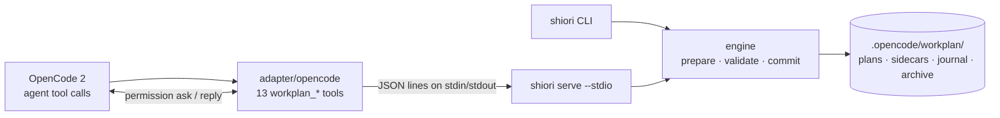

<div align="center">

# Shiori

**しおり, "bookmark"**

**A local-first workplan engine that keeps an agent's plan, progress and next step safe across sessions.**

*A Go core and CLI with a native OpenCode adapter for the `workplan_*` tools.*

[](go.mod)
[](LICENSE)
[](#opencode-adapter)

[Features](#features) · [Architecture](#architecture) · [Quick start](#quick-start) · [OpenCode adapter](#opencode-adapter) · [Development](#development) · [Docs](#documentation)

</div>

> **Shiori keeps the bookmark. The agent does the work.**
>
> Long tasks outlive a single session: context gets compacted, processes crash, plans grow to hundreds of kilobytes. Shiori owns the plan files in `.opencode/workplan/` and makes every change to them explicit, authorized and recoverable. It never calls a model, edits your code or decides what to do next.

> [!NOTE]
> **Pre-1.0.** Shiori is used daily as the workplan backend of an OpenCode 2 setup. Its on-disk formats (V2 plans, checkpoints, dependency sidecars, journals) are stable and compatible with the original TypeScript workplan design it replaces. CLI flags and the adapter protocol may still change before 1.0.

## At a glance

| | |
| --- | --- |
| **Core** | One Go binary (`shiori`) with no runtime dependencies; `CGO_ENABLED=0` gives a static binary on Linux |
| **Interfaces** | `shiori` CLI (human or `--json` output) · `shiori serve --stdio` JSON-lines protocol · OpenCode plugin in `adapter/opencode/` |
| **Tools** | 13 `workplan_*` tools: `create`, `update`, `patch`, `reset`, `checkpoint`, `compact`, `compact_preview`, `read`, `inspect`, `list`, `validate`, `resume`, `doctor` |
| **Storage** | `.opencode/workplan/`: `<id>.json` + `<id>.md`, `<id>.checkpoint.json`, `<id>.dependencies.json`, `<id>.transaction.json` (journal), `<id>.evidence.json`, `<id>.lanes.json`, `<id>.history.jsonl` (change log), `<id>.links.json`, `archive/<id>/` |
| **Writes** | Prepare → authorize → commit, stale-hash check, workspace and plan locks, durable journal |
| **Validated on** | darwin/arm64 with Go 1.27.1, bun 1.4.0 and OpenCode 2.0.19/2.0.20. Linux builds and passes `go vet` but is not yet validated end to end |

## Features

### Durable plans and safety
- **Prepare → authorize → commit:** every mutation is first prepared as an exact intent (each target with before/after sha256, the journal, the locks) without creating any file, lock or directory. Only a confirmed or host-authorized commit of that unchanged intent writes.
- **Stale-state protection:** existing-state writes carry `--expected-hash` (the `stateHash` from the latest read), and every precondition is rechecked under the lock.
- **Locks:** a workspace lock, then a plan lock. Live, foreign-host and ambiguous owners are never reclaimed; a proven-dead owner only after a grace period.
- **Journal and crash recovery:** files are staged and fsynced, a durable journal is published before the first replacement, and each artifact is replaced atomically. A crash leaves the journal in place; `update --recovery resume|rollback` finishes or undoes the transaction. The v2 journal names the staged files and hard-linked before images instead of inlining them, so a write costs about the size of the changed files (`--journal-version 1` keeps the inline v1 format).
- **Safe resets and repair:** `reset` defaults to a status-only draft reset. A full wipe needs a preview token and an explicit confirmation, and archives the originals first. An unreadable plan gets a raw-byte hash so `create --overwrite` can repair it, archiving the damaged bytes.

### Bounded continuation
- **Resume budgets:** `resume` returns a continuation packet that fits a UTF-16 budget (`--max-chars 4096-64000`): current work, next action, safety constraints and a ranked page of open work. Shortened text is marked and listed; file paths are never shortened.
- **Cursors:** `resume` and `inspect` page with tamper-checked cursor tokens bound to the plan, the budget and the filters.
- **Filtered reads:** `read --phase/--step` returns a slice of the plan instead of the whole document.

### Dependency graph
- **Readiness:** with a dependency sidecar, open steps are `ready` (with how many steps they unblock) or `blocked` (with the unfinished prerequisites). Ready work is ranked first.
- **Order checks warn, never refuse:** starting or completing a step early, cancelled prerequisites and backward links are reported by `update`, `validate` and `doctor`. A phase replacement that would leave links dangling is refused.
- **Critical path:** `inspect` and `doctor` show the longest chain of open steps, optionally weighted by a step `estimate`.

### Compaction advisor and note rollover
- **Advice:** `doctor` recommends compaction when it would save at least 32 KiB of plan JSON and a threshold is crossed (notes, archivable phases, plan size), with the exact savings and a ready-to-preview selection. `resume` includes the advice only when it costs no page items.
- **Rollover:** `compact --rollover` archives notes older than the latest N, keeping pinned notes, decisions, notes about open work and recent archive pointers. The archive keeps the complete originals.
- **Tunable:** `--compaction-advice off|min-savings-kib=N,notes=N,terminal-percent=N,plan-kib=N,keep-notes=N` on `resume`, `doctor` and `serve`.

### Evidence ledger
- **Checkable completion:** `update --input '{"recordEvidence":[...]}'` (or the `recordEvidence` tool member) records the command run for a step, its exit code and an output digest in `<id>.evidence.json`, bound to the git tree of the working state. Recording evidence alone leaves the plan and its hashes unchanged.
- **Staleness:** `inspect`, `resume` and `doctor` show each step as `fresh`, `stale` (the code changed since, optionally only within `scope` paths), `failing` or `unknown`. Completing a step without fresh evidence warns once a plan uses the ledger.
- **Run and record:** `shiori evidence my-plan --phase P --step S --expected-hash H -- go test ./...` runs the command and records its real result. The git tree is computed on a private index and object store; the repository is never written.
- **Re-verify:** `shiori verify my-plan` lists the commands recorded that way for steps whose evidence went stale or failing, and after confirmation re-runs them and records the results (exit status 1 if any still fails). Commands recorded any other way are listed but never run.
- **Status report:** `shiori report my-plan` prints a Markdown report (or `--json`): progress per phase, open work, the critical path, evidence with the commit each passing result verified ("verified in 1a2b3c4"), open high findings, lanes and recent activity.

### Worktree lanes
- **Claims, not collisions:** `update --input '{"lanes":[{"op":"propose",...}]}'` gives a lane its steps and path claims; overlapping claims and double-owned steps are refused. Lanes move claimed → prepared (with their worktree) → running → review → integrating → merged.
- **Checked, never acted on:** `doctor` verifies each checkout, lists files changed outside a lane's claims, flags cleanup-required and unowned worktrees, and suggests a merge order from the dependency graph. Shiori never runs `git worktree`, merges or deletes.
- **Lane evidence:** evidence recorded in a lane (`shiori evidence --lane L -- ...`) is checked against the lane checkout, and goes stale after merging until it is repeated on the combined state.

### Change log and rebased writes
- **Every write recorded:** each committed write appends one hash-chained line to `<id>.history.jsonl`: the operation, who made it (agent, CLI or MCP), the hashes before and after, and the steps, phases, findings and notes it changed. `shiori history my-plan` prints it. The log is advisory: outside the plan hashes, and edits made outside Shiori show up as gaps.
- **Fewer stale-hash refusals:** with `rebase: true` (or `--rebase` on `serve`, `mcp` and `update`), a write whose `expectedHash` is stale still applies when every newer write changed other parts of the plan; it is refused only when they overlap.
- **Handoffs:** `resume` shows what changed since the last checkpoint (step moves, findings, notes); `doctor` reports steps in progress for over three days with no new evidence.

### Planning aids
- **Templates:** `shiori create my-fix --goal G --template bugfix` (also `feature`, `migration`) starts a plan with standard phases and steps that already name what to run.
- **Plan quality:** `shiori report` (and `doctor`, once a plan records evidence) lists open steps with no validation or with a validation that names nothing to run, and open blocker findings with no step left to resolve them.
- **Several plans:** `planLinks` records that a plan blocks, waits for or relates to another. `shiori portfolio` and `doctor` show each plan's progress and what it waits on, and `resume` says when an unfinished plan blocks the current one.

### OpenCode adapter
- **13 `workplan_*` tools** with the same names, argument shapes, result text and role matrix as the TypeScript plugin they replace, served by a lazily started `shiori serve --stdio` child.
- **Host permission bridge:** the adapter proves the host instance, asks the host's permission engine for `edit` on the exact canonical resources of each prepared intent, and commits only after an allow or a genuine user reply. It never answers permissions or edits rules itself.
- **Fails closed:** on an unverified OpenCode version the read-only tools keep working and every mutating tool is refused with an actionable message.
- **No dependencies:** only `node:` built-ins and types from `@opencode/plugin` (a peer dependency).

## Architecture



The stdio child belongs to one adapter instance: there is no network listener and no daemon. It exits on stdin EOF, on SIGTERM, or after 10 minutes with no request and no prepared intent. stdout carries protocol frames only; stderr carries redacted one-line diagnostics.

## Quick start

**Requirements:** Go 1.27.1 or newer. For the adapter: OpenCode 2.0.19 or 2.0.20, and bun to run its tests.

```sh
# 1. Build
CGO_ENABLED=0 go build -trimpath -o shiori ./cmd/shiori

# 2. Write (with shiori on PATH, inside a project): each command prints the prepared intent, then asks for confirmation
shiori create my-plan --goal "Ship it" --input '{"phases":[{"title":"Build","steps":[
  {"title":"Write the API","action":"Implement the handlers","validation":"go test ./..."}]}]}'
H=$(shiori read my-plan --json --no-markdown | jq -r .stateHash)
shiori update my-plan --expected-hash "$H" --status in_progress --append-note "started"
H=$(shiori read my-plan --json --no-markdown | jq -r .stateHash)
shiori checkpoint my-plan --expected-hash "$H" --summary "Plan created" \
  --next-action "Write the API" --phase build --step write-the-api
# checkpoint replaces the whole checkpoint; --merge keeps every field you omit
H=$(shiori read my-plan --json --no-markdown | jq -r .stateHash)
shiori checkpoint my-plan --expected-hash "$H" --merge --append-validation "go test ./... passed"

# record evidence: runs the command, binds it to the current git tree (stateHash stays the same)
H=$(shiori read my-plan --json --no-markdown | jq -r .stateHash)
shiori evidence my-plan --phase build --step write-the-api --expected-hash "$H" --scope src -- go test ./...

# 3. Read: never prompts, writes, locks or changes an mtime
shiori list
shiori resume  my-plan --max-chars 12000
shiori inspect my-plan
shiori doctor
```

Confirm by typing `yes` on a terminal, or pass `--yes` off a terminal (a flag only, never an environment variable; it never bypasses the hash, lock or journal checks). `--root` defaults to the current directory. `--json` prints exactly the result the matching `workplan_*` tool returns, and `--input '<json>'` accepts any tool input. Exit status is 0 on success, 1 on an operation error, a refusal or an invalid plan, and 2 on a usage error. `shiori --help` lists every command and flag.

## MCP server

`shiori mcp` serves the same tools (names, descriptions and input schemas as the OpenCode adapter) to any MCP client over stdio (protocol 2025-03-26 to 2025-11-25). Register it under the name `workplan` and keep the default empty tool prefix, so clients that prefix tools with the server name show `workplan_resume`, `workplan_update`, …

```sh
# Claude Code (tools appear as mcp__workplan__resume, ...)
claude mcp add workplan -- /abs/path/shiori mcp --root /abs/path/to/project
```

```jsonc
// OpenCode 2.0.24 (tools appear as workplan_resume, ...)
{ "mcp": { "servers": { "workplan": { "type": "local", "command": ["/abs/path/shiori", "mcp", "--root", "/abs/path/to/project", "--write-approval", "client"], "codemode": false } } } }
```

- **Root:** `--root` (trusted server configuration). Without it the client's MCP roots are used, and exactly one `file://` root is required. Tool input can never choose the root.
- **Writes** are prepared without touching anything and committed only after approval. `--write-approval auto` (the default) asks the user through MCP elicitation, showing the plan and every file the write touches, when the client supports it. Otherwise it relies on the client's own tool-call approval. `elicitation` refuses writes without elicitation, `client` always relies on the client, and `deny` makes the server read-only. Every precondition is still rechecked under the locks.
- **Resources:** each plan's resume packet, status report and change log are readable as `workplan://<id>/resume`, `/report` and `/history`. Subscribed resources are announced (`notifications/resources/updated`) after writes through the server and, within two seconds, after changes made elsewhere; a new or removed plan sends `notifications/resources/list_changed`.
- Also: `--tool-prefix`, `--journal-version 1|2`, `--compaction-advice SPEC`, `--rebase`. Requests and outcomes are logged on stderr.

Compared with the OpenCode adapter, an MCP client approves per tool call (or per elicitation prompt), not through OpenCode's permission engine on exact file paths, and the host version policy and session facts do not apply.

## OpenCode adapter

Vendor Shiori into your OpenCode configuration directory and build the binary there:

```sh
cd ~/.config/opencode
git submodule add https://github.com/hoshinoht/shiori.git vendor/shiori
(cd vendor/shiori && CGO_ENABLED=0 go build -trimpath -o shiori ./cmd/shiori)
```

Then add the package to the `plugins` list in `opencode.json`, in place of any other workplan plugin (never both: they register the same tools):

```jsonc
{
  "package": "./vendor/shiori/adapter/opencode",
  "options": {
    "bin": "{env:HOME}/.config/opencode/vendor/shiori/shiori",
    // Optional: compaction advisor thresholds ("off", or any subset of the keys)
    "compactionAdvice": { "minSavingsKiB": 32, "notes": 50, "keepNotes": 20 }
  }
}
```

- `package` is relative to the configuration directory. `bin` must resolve to the absolute path of the built binary; OpenCode expands `{env:HOME}` in plugin options. Instead of the option, `SHIORI_BIN` can be set in the environment OpenCode starts in. `PATH` is never searched and nothing is downloaded.
- `compactionAdvice` takes `"off"` or an object with any of `minSavingsKiB` (default 32), `notes` (50), `terminalPercent` (25), `planKiB` (192) and `keepNotes` (20). An invalid value fails plugin load with a message naming the option.
- Restart OpenCode and run `workplan_doctor`: its runtime facts show whether the plugin is effective and which tools are registered.
- Optional single-file build: `cd adapter/opencode && bun build ./index.ts --target=bun --format=esm --outfile /abs/path/shiori-opencode.js`.

## Development

```sh
gofmt -l .
go vet ./...
go test -race ./...
(cd adapter/opencode && bun test)        # builds shiori unless SHIORI_BIN is set
CGO_ENABLED=0 go build -trimpath ./cmd/shiori

go test ./internal/ojson -run '^$' -fuzz '^FuzzParse$' -fuzztime 30s
go test ./internal/engine -run '^$' -bench Ops -benchmem   # 100 KiB to 10 MiB fixtures
```

The conformance suite (`internal/conformance`) replays a frozen golden corpus recorded from the original TypeScript engine (`testdata/`, hashes pinned in `testdata/MANIFEST.json`) against the engine's exported API. Every output is byte-identical to the reference except the vectors listed in `testdata/expected/expectations.json`, whose field-level comparators prove that only the documented difference occurs (each entry names its reason and contract section, and design changes are pinned by hash). They also cover fault injection, crash recovery in separate processes, lock reclamation and the protocol framing limits. The adapter tests run the real core against fakes of the OpenCode host; an opt-in runtime smoke (`SHIORI_RUNTIME_SMOKE=1`) drives a private OpenCode server without calling a model. The JSON Schema validator is a test-only dependency and is not linked into the binary.

<details>
<summary>Repository layout</summary>

| Path | Contents |
| --- | --- |
| `cmd/shiori` | CLI entry point |
| `internal/cli` | Commands, human output, confirmation, `serve` |
| `internal/engine` | Tool operations: read, resume, inspect, validate, doctor, create, update, patch, reset, checkpoint, compact, recovery, repair |
| `internal/input` | Tool input parsing and validation for both surfaces |
| `internal/resume` | Resume packet, budget policy, paging cursors |
| `internal/advisor` | Compaction advice and note rollover selection |
| `internal/conformance` | Black-box parity suite over the golden corpus |
| `internal/storage` | Prepared intents, locks, staging, journals, commit |
| `internal/protocol` | stdio JSON-lines server: handshake, prepare/commit, cancellation |
| `internal/model`, `internal/index` | Plan V2 model, sidecars, Markdown rendering, dependency graph |
| `internal/ojson`, `internal/snapshot` | Order-preserving JSON, plan and state hashing |
| `adapter/opencode` | OpenCode plugin: tool registration, core client, host permission bridge |
| `schema/v1` | JSON Schema 2020-12 contract for storage, tool inputs and the protocol |
| `testdata/` | Golden corpus, fixtures, documented differences (`expected/`), perf fixtures |
| `docs/` | Specifications, contract, baseline measurements, status |

</details>

## Documentation

- [Specifications](docs/specs/): [core](docs/specs/01-core.md), [protocol and adapter](docs/specs/02-protocol-and-adapter.md), [performance](docs/specs/03-performance.md), [worktrees](docs/specs/04-worktrees.md), [migration and acceptance](docs/specs/05-migration-and-acceptance.md), [extensions](docs/specs/06-extensions.md)
- [Contract](docs/contracts.md): the frozen v1 contract and every approved design change
- [Status](docs/STATUS.md): the stage-by-stage record, evidence and open decisions
- [Baseline](docs/baseline.md): measured latency and memory against the TypeScript reference
- [Machine schemas](schema/index.json) and the [golden corpus manifest](testdata/MANIFEST.json)

## Non-goals

Shiori is not an agent, a task runner, a project-management service or a sync server. It does not call models, run your code, listen on the network, migrate or rename plans automatically, or rename tools and agents.

## License

[GNU General Public License v3.0](LICENSE)
